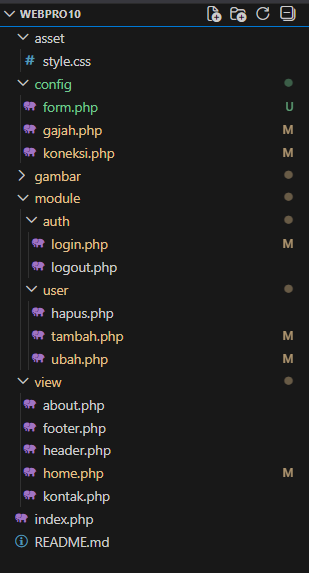
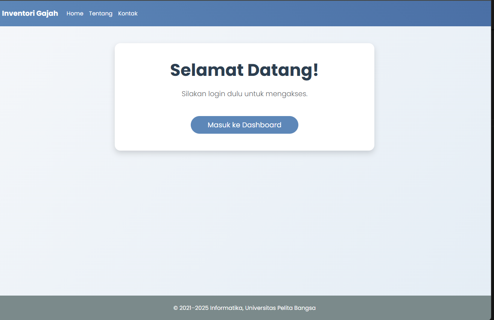
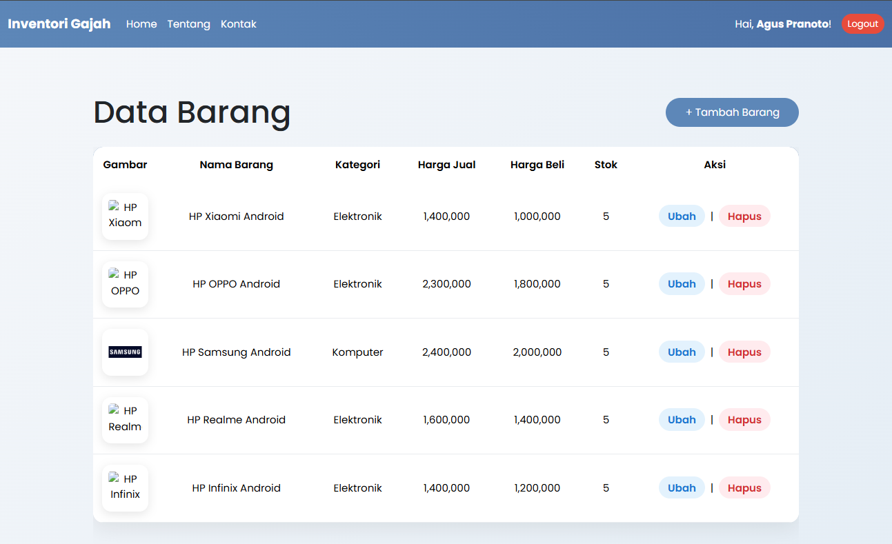
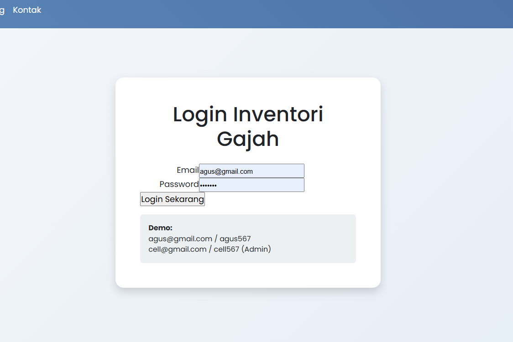

# Latihan OOP PHP lanjutan


Halo halo, Sekarang disini akan mencoba menggunakan PHP dengan OOP part 2.
Cek juga repo lain nya:
 [Html dasar](https://github.com/laLafid/Lab1Web), [CSS dasar](https://github.com/laLafid/lab2web), [CSS](https://github.com/laLafid/Lab3Web), [CSS Layout](https://github.com/laLafid/Lab4Web), [Dasar Javascript](https://github.com/laLafid/Lab5Web), [Dasar Bootstarp](https://github.com/laLafid/Lab6Web), [Dasar PHP](https://github.com/laLafid/Lab7Web), [CRUD PHP](https://github.com/laLafid/Lab8Web),  [Modular PHP](https://github.com/laLafid/Lab9Web) dan [OOP PHP](https://github.com/laLafid/Lab10Web)


## Langkah-langkah

1. **Persiapan**
    - Editornya, misal Visual Studio Code.
    
    
    - XAMPP, kalo belum punya unduh dulu di [sini](https://www.apachefriends.org/).

    - Buka XAMPP control panel dulu, aktifin ``apache`` dan ``mysql`` lalu pencet admin dibagian ``mysql`` buat masuk ke phpmyadmin.
    

    - Pake Database sebelumnya, kalo belum punya cek [CRUD PHP](https://github.com/laLafid/Lab8Web)

    - Koneksi Database pake PHP

    
    
    liat ``config.php``

    - jangan lupa ya path file dan folder nya udah berubah lagi..

    


2. **Penerapan**

    - Untuk menuju OOP(part 2?), atur file nya seperti pada gambar tadi:
        - pindah beberapa file dari yang [sebelumnya](https://github.com/laLafid/Lab10Web) 
        - ``gajah.php`` jadi ``db.php``
        - ``koneksi.php`` jadi ``config.php``
        - ``form.php`` di update 🥲
        - beberapa update kecil ke semua modul yang memakai ``form.php``

    - nih contoh penggunaan form baru ada di ``ubah.php``
    ```php
    $form = new Form("", "Update Barang"); // aiueo ubah dikit aja
    $form->addField("id", "", "hidden", $id);
    $form->addField("nama", "Nama Barang", "text", $data['nama']);
    $form->addField("kategori", "Kategori", "select", $data['kategori'], [
        "Komputer" => "Komputer",
        "Elektronik" => "Elektronik",
        "Hand Phone" => "Hand Phone"
    ]);
    $form->addField("harga_jual", "Harga Jual", "number", $data['harga_jual']);
    $form->addField("harga_beli", "Harga Beli", "number", $data['harga_beli']);
    $form->addField("stok", "Stok", "number", $data['stok']);
    $form->addField("file_gambar", "Ganti Gambar (kosongkan jika tidak diganti)", "file");
    $form->displayForm();
    ```

    - ada 1 file baru namanya ``.htaccess``, buat ``index.php`` ?? dan keamanan (mhon koreksinya) 


3. **Hasil Akhir**

    Tampilan masih sama ya.. 
    
    

    

    
    
    

    
## Akhri Kata


*Selamat mencoba*
